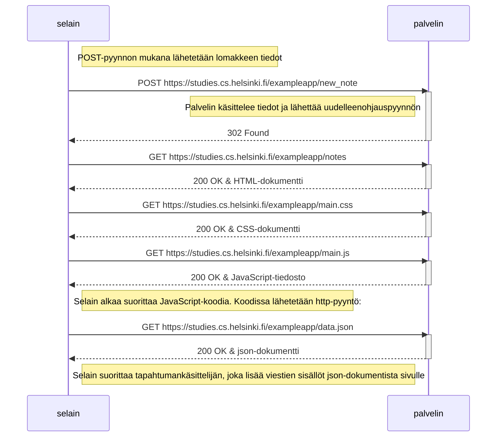

```mermaid
sequenceDiagram
    participant selain
    participant palvelin
    
    Note right of selain: POST-pyynnon mukana lähetetään lomakkeen tiedot
    selain->>palvelin: POST https://studies.cs.helsinki.fi/exampleapp/new_note
    activate palvelin
    Note left of palvelin: Palvelin käsittelee tiedot ja lähettää uudelleenohjauspyynnön
    palvelin-->>selain: 302 Found
    deactivate palvelin

    selain->>palvelin: GET https://studies.cs.helsinki.fi/exampleapp/notes
    activate palvelin
    palvelin-->>selain: 200 OK & HTML-dokumentti
    deactivate palvelin

    selain->>palvelin: GET https://studies.cs.helsinki.fi/exampleapp/main.css
    activate palvelin
    palvelin-->>selain: 200 OK & CSS-dokumentti
  	deactivate palvelin

    selain->>palvelin: GET https://studies.cs.helsinki.fi/exampleapp/main.js
    activate palvelin
    palvelin-->>selain: 200 OK & JavaScript-tiedosto
    deactivate palvelin

    Note right of selain: Selain alkaa suorittaa JavaScript-koodia. Koodissa lähetetään http-pyyntö:
    selain->>palvelin: GET https://studies.cs.helsinki.fi/exampleapp/data.json
    activate palvelin
    palvelin-->>selain: 200 OK & json-dokumentti
    deactivate palvelin

    Note right of selain: Selain suorittaa tapahtumankäsittelijän, joka lisää viestien sisällöt json-dokumentista sivulle
```
